title: Pelican Themes that I Like
date: 12/03/2019
tags: pelican, themes
keywords: pelican, blogging
category: blogging
slug: pelican-themes-that-i-like
author: John Yu
summary: 
lang: en
status: draft

[voidy-bootstrap](https://github.com/robulouski/voidy-bootstrap/tree/83f4d802710bbfa20123a9b7f1921424e292ef53)
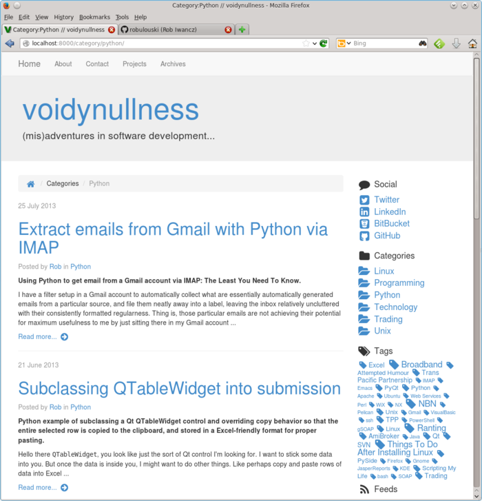

[simple-bootstrap](https://github.com/getpelican/pelican-themes/tree/master/simple-bootstrap)
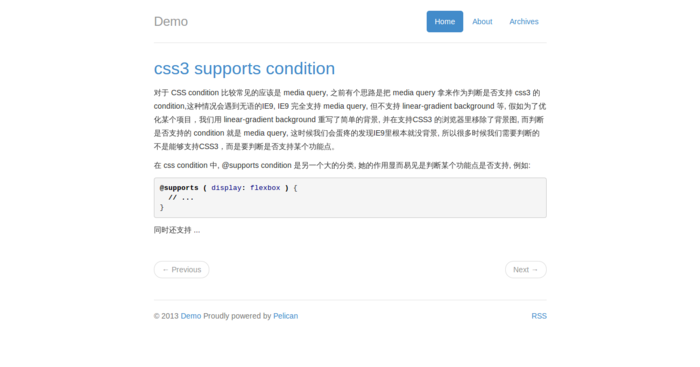

[resume](https://github.com/suheb/resume/tree/ee7dcf1239a3554490f047ee36430d1a799a0882)
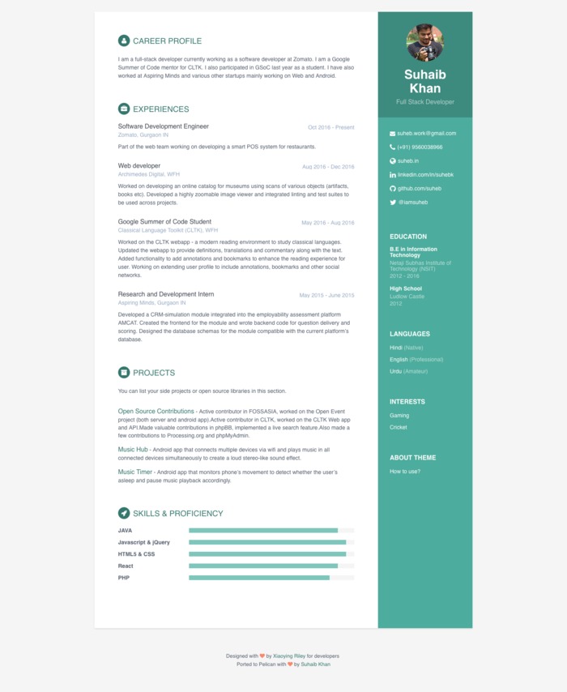

[plumage](https://github.com/kdeldycke/plumage/tree/6e0dd7acaff3041f52205e1e58060473910029d9)
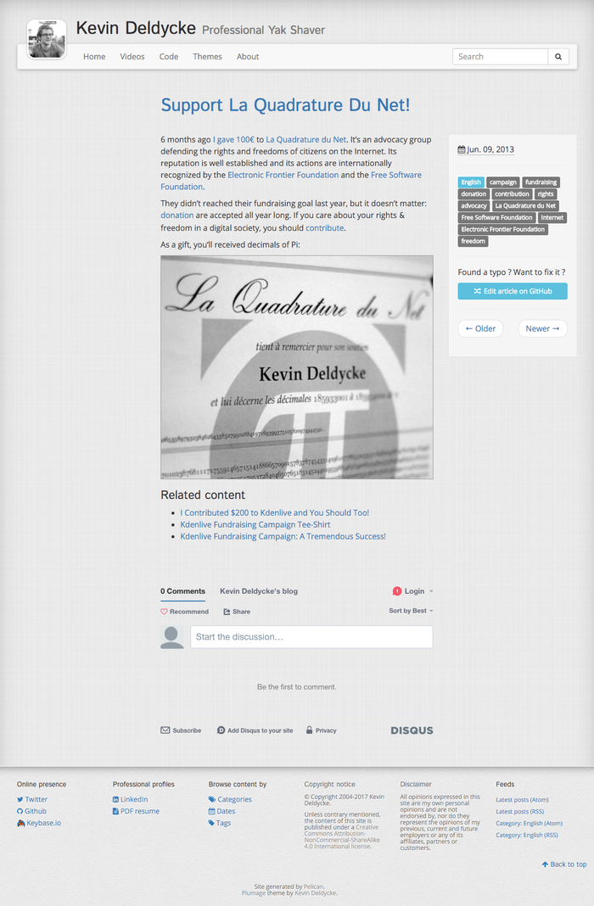

[photowall](https://github.com/getpelican/pelican-themes/tree/master/photowall)
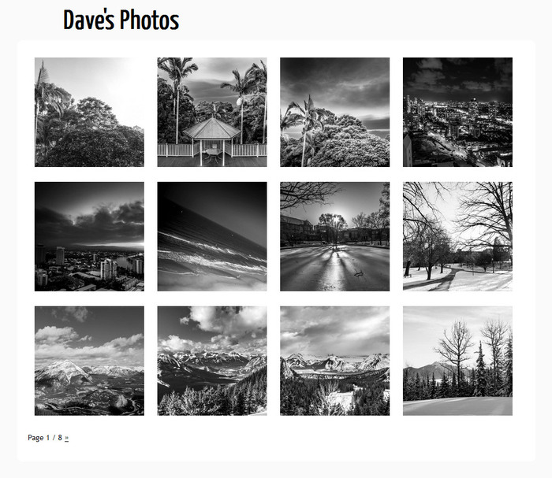

[pelican-striped-html5up](https://github.com/getpelican/pelican-themes/tree/master/pelican-striped-html5up)
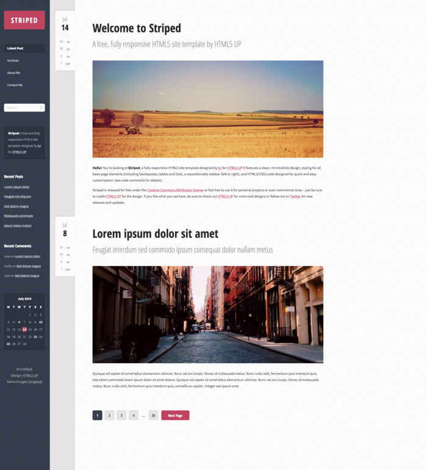

[pelican-bootstrap3](https://github.com/getpelican/pelican-themes/tree/master/pelican-bootstrap3)
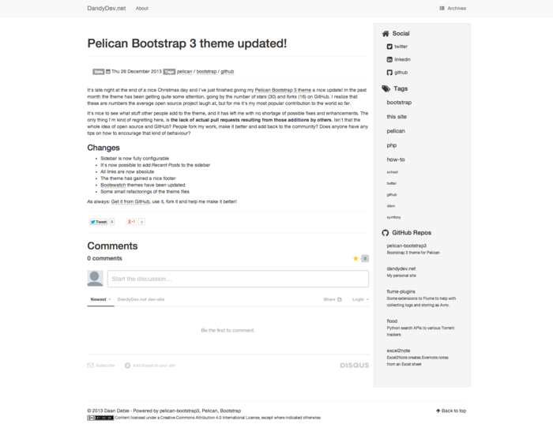

[notmyidea](https://github.com/getpelican/pelican-themes/tree/master/notmyidea-cms)
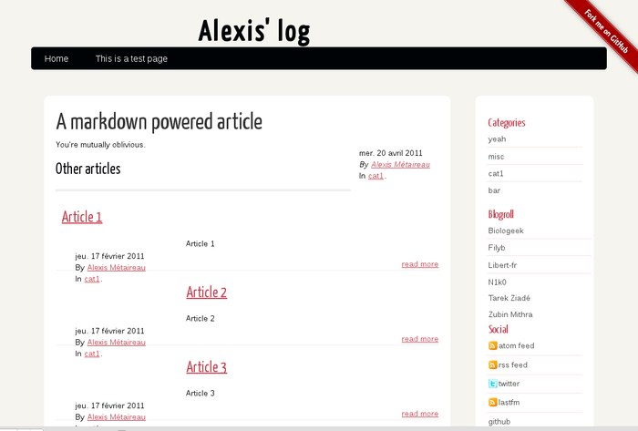

[nest](https://github.com/molivier/nest/tree/18aa1345f70219c00704848d321daf45c2f50ba7)
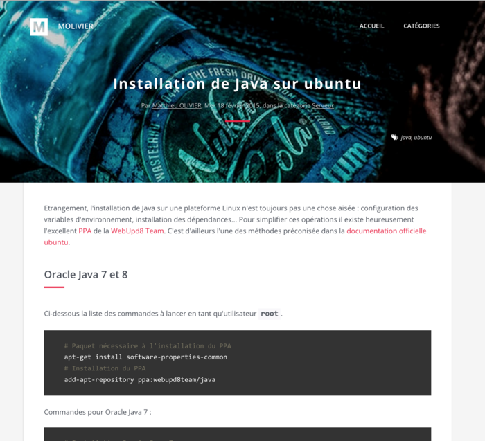

[flex](https://github.com/alexandrevicenzi/Flex/tree/b3bd59002a3e85803332c35702d90e1e19ef39b6)
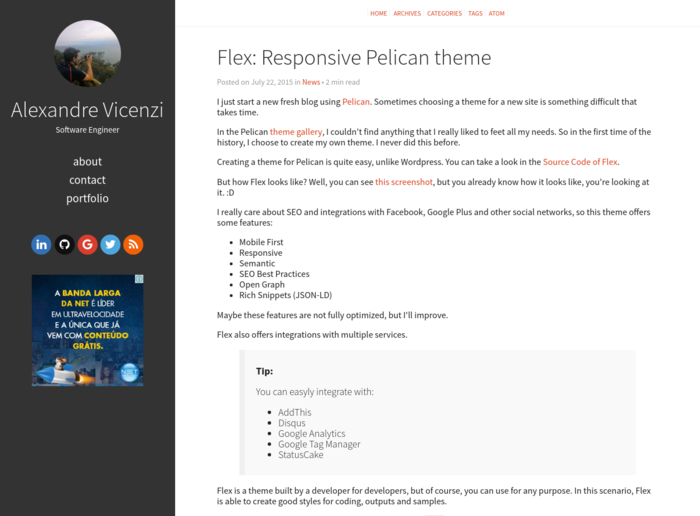

[bulrush](https://github.com/textbook/bulrush/tree/19b2fc4d79e7c060218172ae5484a4a216b40921)
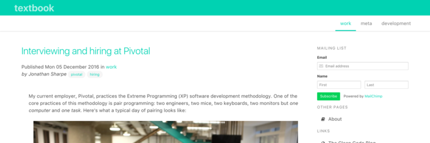

[bootlex](https://github.com/getpelican/pelican-themes/tree/master/bootlex)
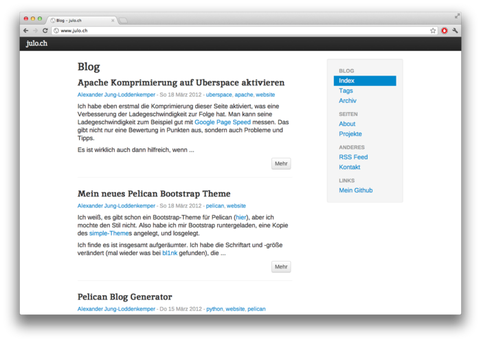

[bold](https://github.com/demianbrecht/pelican-bold/tree/b27e6056b530b4a9df863e074503e11dc353d708)
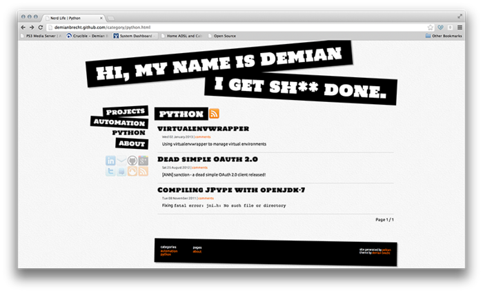
